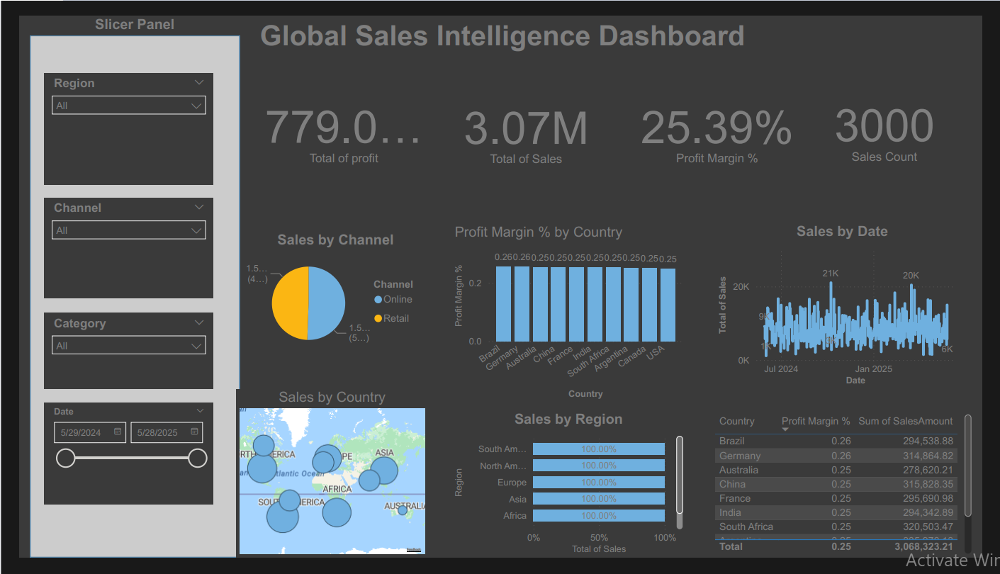

# 🔎 Global Sales Intelligence – Power BI Project

## 📌 Overview
Global Sales Intelligence is a comprehensive Power BI project that provides a complete view of global sales performance, profit margins, sales channels, and regional insights.  
This repository includes the Power BI report, related datasets (if available), and a dashboard preview image.

---

## 🎯 Objectives
- Provide a 360° analytical view of global sales.
- Compare performance across regions, countries, and channels.
- Analyze daily sales trends and seasonal patterns.
- Monitor profit margins across different markets.
- Support data-driven strategic decision-making.

---

## 🛠 Tools & Techniques
- Power BI (`.pbix`)
- Power Query (ETL & data cleaning)
- DAX measures & calculations
- Data modeling (Star Schema)
- Time-series analysis
- Geo mapping (country-level visuals)
- Interactive slicers (Region, Channel, Category, Date)

---

## 📁 Files in this folder
- `Global Sales Intelligence.pbix` — Main Power BI report.  
- `sales.csv` — Sales fact table.  
- `products.csv` — Product catalog (if included).  
- `channels.csv` — Sales channels data.  
- `countries.csv` — Country details.  
- `Global Sales Intelligence.png` — Dashboard preview image.  
- `README.md` — Project documentation.

> **Note:** File names must match exactly with the ones uploaded in this folder for images and links to work correctly.

---

## 📷 Dashboard Preview

---

## 🔍 Suggested Key Insights (Examples)
- Sales are distributed between Online and Retail channels depending on country.  
- Profit margin remains stable across most markets (~0.25–0.26).  
- Countries like **Brazil, Germany, Australia, France** show high sales contribution.  
- Daily sales trends highlight peaks around **20K–21K**, indicating strong seasonal demand periods.  
- Regional performance shows balanced contributions across **North America, Europe, Asia, Africa**.

---

## 🚀 How to Use
1. Open `Global Sales Intelligence.pbix` using Power BI Desktop.  
2. Ensure dataset paths are correct. Update them through **Transform Data → Data Source Settings** if required.  
3. Use slicers (Region, Channel, Category, Date) to explore the dashboard interactively.  
4. Replace CSV files with updated versions using the same file names to refresh the data.

---

## 📦 Tips & Best Practices
- Avoid using spaces in file names when possible (e.g., `Global_Sales_Intelligence.png`).  
- If the `.pbix` file is too large, upload it to OneDrive/Google Drive and attach the download link in the README.  
- Keep the preview image in the same folder as the README to ensure proper rendering.

---

## 📄 Files Recap
- `Global Sales Intelligence.pbix`  
- `Global Sales Intelligence.png`  
- `sales.csv`  
- `products.csv`  
- `channels.csv`  
- `countries.csv`  
- `README.md`

---

## 🎯 Conclusion
The Global Sales Intelligence dashboard provides a complete analytical perspective on worldwide sales, enabling organizations to identify top-performing regions, optimize channels, monitor profit margins, and analyze trends over time.  
This report is a powerful asset for strategic planning and business growth.

